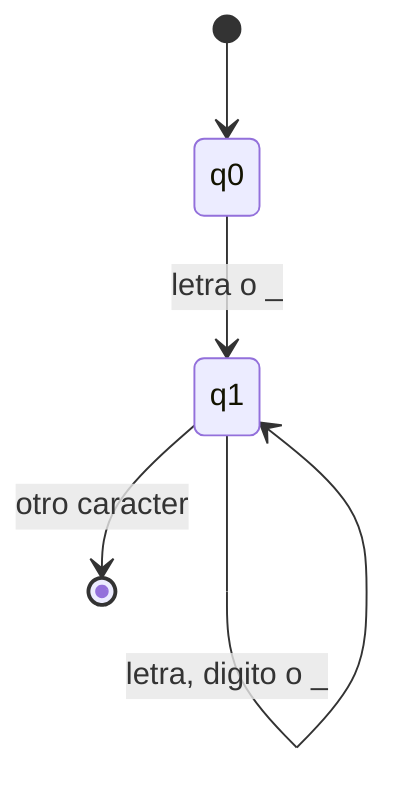
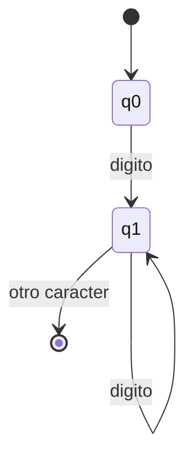
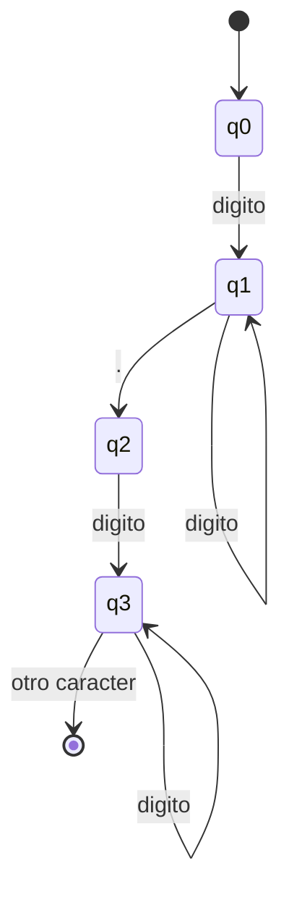

# Informe tecnico - MathLite

## 1. Definicion formal del lenguaje

MathLite es un DSL imperativo, de tipado dinamico y evaluacion estricta,
orientado a calculos matematicos basicos.

### Alfabeto

El alfabeto Sigma incluye:

- Letras: `a-z`, `A-Z`
- Digitos: `0-9`
- Espacios: espacio, tabulacion, retorno de carro y salto de linea
- Operadores: `+ - * / ^ % = ! < >`
- Delimitadores: `( ) { } , ;`
- Comillas dobles para cadenas: `"`
- Guion doble para comentarios de linea: `--`

### Categorias de tokens

- Palabras reservadas: `let`, `def`, `return`, `if`, `else`, `while`, `print`
- Booleanos y logicos: `true`, `false`, `and`, `or`, `not`
- Funciones integradas: `sin`, `cos`, `tan`, `sqrt`, `log`, `abs`, `floor`, `ceil`
- Identificadores: letra o `_`, seguido de letras, digitos o `_`
- Literales: enteros, reales, cadenas
- Operadores: `+`, `-`, `*`, `/`, `^`, `%`, `==`, `!=`, `<`, `>`, `<=`, `>=`, `=`
- Delimitadores: `(`, `)`, `{`, `}`, `,`, `;`

## 2. Gramatica EBNF

```ebnf
program       ::= statement* EOF ;
statement     ::= let_stmt
                | func_def
                | if_stmt
                | while_stmt
                | return_stmt
                | print_stmt
                | expression ;

let_stmt      ::= "let" IDENT "=" expression ;
func_def      ::= "def" IDENT "(" params? ")" block ;
params        ::= IDENT ("," IDENT)* ;
block         ::= "{" statement* "}" ;
if_stmt       ::= "if" expression block ("else" block)? ;
while_stmt    ::= "while" expression block ;
return_stmt   ::= "return" expression ;
print_stmt    ::= "print" "(" expression ")" ;

expression    ::= or_expr ;
or_expr       ::= and_expr ("or" and_expr)* ;
and_expr      ::= not_expr ("and" not_expr)* ;
not_expr      ::= "not" not_expr | comparison ;
comparison    ::= addition (("==" | "!=" | "<" | ">" | "<=" | ">=") addition)* ;
addition      ::= multiplication (("+" | "-") multiplication)* ;
multiplication::= power (("*" | "/" | "%") power)* ;
power         ::= unary ("^" power)? ;
unary         ::= "-" unary | primary ;
primary       ::= INT | REAL | STRING | "true" | "false"
                | IDENT
                | IDENT "(" args? ")"
                | builtin "(" args? ")"
                | "(" expression ")" ;
args          ::= expression ("," expression)* ;
builtin       ::= "sin" | "cos" | "tan" | "sqrt" | "log" | "abs" | "floor" | "ceil" ;
```

## 3. AFD lexicos

### Identificadores



### Enteros



### Reales



## 4. FIRST y FOLLOW principales

| No terminal | FIRST | FOLLOW |
| --- | --- | --- |
| program | `let`, `def`, `if`, `while`, `return`, `print`, literal, IDENT, `(`, `-`, `not`, EOF | EOF |
| statement | `let`, `def`, `if`, `while`, `return`, `print`, literal, IDENT, `(`, `-`, `not` | inicio de statement, `}`, EOF |
| block | `{` | inicio de statement, `else`, `}`, EOF |
| expression | literal, IDENT, builtin, `(`, `-`, `not` | `)`, `{`, `}`, `,`, inicio de statement, EOF |
| primary | INT, REAL, STRING, `true`, `false`, IDENT, builtin, `(` | operadores, `)`, `}`, `,`, EOF |

## 5. Flujo del interprete

```text
codigo fuente
  -> Lexer: tokens + errores lexicos
  -> Parser: AST + errores sintacticos
  -> SemanticAnalyzer: tabla de simbolos + tipos inferidos + errores semanticos
  -> Interpreter: evaluacion del AST + salida + errores de ejecucion
```

## 6. Estructura del AST

El AST se implementa explicitamente en `src/ast_nodes.py`. Los nodos principales
son `ProgramNode`, `BlockNode`, `AssignNode`, `FuncDefNode`, `FuncCallNode`,
`IfNode`, `WhileNode`, `ReturnNode`, `PrintNode`, `BinOpNode`, `UnaryOpNode`,
`NumberNode`, `BoolNode`, `StringNode` y `VariableNode`.

## 7. Reglas semanticas implementadas

- Toda variable debe declararse antes de usarse.
- Se reporta redeclaracion de variable en el mismo alcance.
- Toda funcion llamada debe existir previamente.
- La aridad de llamadas a funciones debe coincidir con su definicion.
- Las operaciones aritmeticas requieren operandos numericos.
- `return` solo es valido dentro de una funcion.
- Cada nodo de expresion recibe una anotacion `_inferred_type`.

## 8. Casos limite

- Cadenas sin cierre: el lexer reporta error y continua el analisis.
- Ciclos infinitos: el interprete aplica un limite maximo de iteraciones.
- Division y modulo por cero: se reportan como errores de ejecucion.
- Funciones matematicas con argumentos invalidos: se capturan como errores de ejecucion.

## 9. Aplicacion web

La aplicacion Flask en `web/app.py` ofrece:

- Editor de codigo.
- Ejecucion via `/run`.
- Visualizacion de salida, diagnosticos y AST.
- Visualizacion de tokens via `/tokens`.
- Recuperacion de casos guardados via `/cases`.
- Guardado opcional en MongoDB Atlas si se define `MATHLITE_MONGODB_URI`.

## 10. Despliegue

El proyecto incluye `Procfile` y `render.yaml` para despliegue en Render.
Variables de entorno recomendadas:

- `MATHLITE_MONGODB_URI`: cadena de conexion de MongoDB Atlas.
- `MATHLITE_MONGODB_DB`: nombre de base de datos, por defecto `mathlite`.

## 11. Uso de IA

El uso de herramientas de inteligencia artificial generativa debe declararse en
la version final entregada al docente, indicando que se utilizaron como apoyo
para revision, documentacion, pruebas y ajustes de implementacion.
